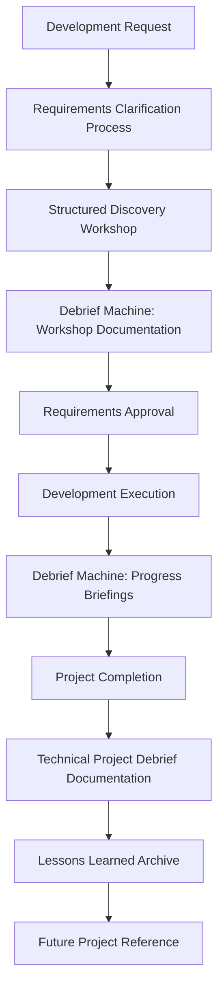

# The Debrief Machine System Overview & Integration Guide

**Version**: 2.1.4  
**Last Updated**: 2025-07-15T15:00:00Z  
**System Status**: Enhanced with Comprehensive Documentation Templates

---

## 🌟 **System Overview**

The Debrief Machine is a comprehensive conversation documentation and project management system designed to capture insights, decisions, and strategic planning from AI-assisted conversations and technical projects. The system has evolved from simple conversation capture to a complete project lifecycle documentation framework.

### **Core Philosophy**
- **Capture everything important** while maintaining practical usability
- **Automate where possible** but preserve user control
- **Structure for action** with clear next steps and ownership
- **Scale appropriately** from simple conversations to complex projects

---

## 🏗️ **System Architecture**

### **Core Components**

#### **1. Auto-Trigger Detection System**
**Purpose**: Automatically detect conversation completion and offer briefing generation

**Confidence Scoring**:
- **High Confidence (15+ points)**: Auto-generate briefing
- **Medium Confidence (8-14 points)**: Ask user if briefing desired

**Integration**: Works across all conversation types and project phases

#### **2. Smart Versioning Engine**
**Purpose**: Automatically determine appropriate version numbers for briefings

**Logic**:
- Search project knowledge for previous debriefs
- Search chat history for version references
- Apply increment logic: v1.0 → v1.1 → v2.0 → v2.1

**Benefits**: Eliminates manual version tracking and ensures consistency

#### **3. Multi-Platform Prompt Library**
**Purpose**: Optimized prompts for different AI platforms

**Variants**:
- **Claude Project Edition** (artifact support, tool tracking)
- **ChatGPT Edition** (Canvas support, reasoning focus)
- **Perplexity Edition** (research focus, source verification)

---

## 📋 **New Documentation Templates (Added in v2.1.4)**

### **Template 1: Comprehensive Technical Project Debrief Documentation**

**File**: `Comprehensive Technical Project Debrief Documentation`  
**Type**: Post-project analysis and documentation template  
**Sections**: 26 comprehensive sections covering all project aspects

#### **Purpose**
- Complete post-project documentation and analysis
- Lessons learned capture for organizational improvement
- Stakeholder communication and reporting
- Knowledge transfer and historical record creation

#### **When to Use**
- After completing any technical project (software, integration, infrastructure)
- For formal project retrospectives and reviews
- When documenting complex projects for future reference
- For regulatory or compliance documentation requirements

#### **Integration with Debrief Machine**
- **Input**: Project conversations, decisions, and outcomes from Debrief Machine briefings
- **Output**: Formal project documentation suitable for organizational archives
- **Workflow**: Use Debrief Machine briefings to populate template sections
- **Benefit**: Transforms conversation insights into professional project documentation

#### **Key Features**
| Feature | Description | Benefit |
|---------|-------------|---------|
| **26-Section Structure** | Comprehensive coverage from executive summary to action items | Ensures nothing important is missed |
| **Quality Metrics** | Built-in scoring and assessment frameworks | Enables continuous improvement |
| **Stakeholder Analysis** | Detailed stakeholder engagement and satisfaction tracking | Improves future stakeholder management |
| **Risk Management** | Comprehensive risk assessment and mitigation documentation | Prevents similar issues in future projects |

---

### **Template 2: Technical Development Requirements Clarification Process**

**File**: `Technical Development Requirements Clarification Process`  
**Type**: Process framework and workflow documentation  
**Structure**: 5-phase structured process with templates and checklists

#### **Purpose**
- Standardize requirements gathering before development begins
- Reduce scope creep, rework, and project failures
- Improve stakeholder communication and alignment
- Create clear documentation for development teams

#### **When to Use**
- Before starting any significant development work (new features, integrations, infrastructure)
- When requirements seem unclear, incomplete, or conflicting
- For projects with multiple stakeholders or complex business rules
- To establish baseline for change management throughout development

#### **Integration with Debrief Machine**
- **Input**: Initial development requests and stakeholder conversations
- **Process**: Use Debrief Machine to document discovery workshops and decisions
- **Output**: Approved requirements that feed into development workflow
- **Feedback Loop**: Use Debrief Machine to capture lessons learned from requirements process

#### **5-Phase Structure**
| Phase | Duration | Purpose | Key Deliverables |
|-------|----------|---------|-----------------|
| **Phase 1: Initial Assessment** | 1-2 days | Feasibility and complexity evaluation | Request acknowledgment, stakeholder identification |
| **Phase 2: Requirements Discovery** | 3-5 days | Structured workshops and documentation | Complete requirements document |
| **Phase 3: Analysis & Validation** | 2-3 days | Quality review and gap analysis | Validated requirements with risk assessment |
| **Phase 4: Approval & Baseline** | 1 day | Stakeholder sign-off and baseline creation | Approved requirements baseline |
| **Phase 5: Change Management** | Ongoing | Controlled change process throughout development | Change requests and impact assessments |

---

## 🔄 **System Integration Workflow**

### **Complete Project Lifecycle Integration**

### **Integration Points**

#### **1. Pre-Development: Requirements Clarification**
- **Trigger**: New development request received
- **Process**: Follow 5-phase requirements clarification
- **Documentation**: Use Debrief Machine to capture workshop outcomes
- **Output**: Approved requirements baseline

#### **2. During Development: Progress Tracking**
- **Trigger**: Regular project milestones or significant decisions
- **Process**: Use Debrief Machine auto-trigger system
- **Documentation**: Generate briefings for key decisions and progress
- **Output**: Decision log and progress documentation

#### **3. Post-Development: Comprehensive Documentation**
- **Trigger**: Project completion or major milestone
- **Process**: Use Technical Project Debrief template
- **Documentation**: Complete post-project analysis
- **Output**: Formal project documentation and lessons learned

### **Data Flow Between Components**

| Source | Information Type | Destination | Purpose |
|--------|------------------|-------------|---------|
| **Requirements Process** | Stakeholder decisions, workshop outcomes | **Debrief Machine** | Document discovery and approval process |
| **Debrief Machine Briefings** | Decisions, timelines, lessons learned | **Project Debrief Template** | Populate comprehensive documentation |
| **Project Debrief Documentation** | Lessons learned, best practices | **Future Requirements Process** | Improve future requirement gathering |
| **All Components** | Process improvements, metrics | **System Enhancement** | Continuous improvement feedback |

---

## 📊 **System Metrics & Success Criteria**

### **Overall System Health**
| Metric | Target | Current | Status |
|--------|--------|---------|---------|
| **Documentation Completeness** | 95% | TBD | 📊 Baseline |
| **User Adoption Rate** | 80% | TBD | 📊 Baseline |
| **Process Compliance** | 90% | TBD | 📊 Baseline |
| **Time to Documentation** | <24 hours | TBD | 📊 Baseline |

### **Component-Specific Metrics**

#### **Auto-Trigger System**
- **Trigger Accuracy**: 90%+ (appropriate activation)
- **False Positive Rate**: <5%
- **User Satisfaction**: 4.0/5.0

#### **Requirements Clarification Process**
- **Requirements Quality Score**: 4.5/5.0
- **Scope Change Rate**: <15% after approval
- **Stakeholder Satisfaction**: 4.0/5.0

#### **Project Debrief Documentation**
- **Section Completion Rate**: 95%+
- **Lessons Applied Rate**: 80%+ (lessons used in subsequent projects)
- **Documentation Quality**: 4.5/5.0

---

## 🛠️ **Implementation Strategy**

### **Phase 1: Foundation (Weeks 1-2)**
**Focus**: Basic system deployment and user training
- Deploy auto-trigger system in active conversations
- Train team on Debrief Machine prompt usage
- Begin using templates for current projects
- Establish baseline metrics

### **Phase 2: Process Integration (Weeks 3-6)**
**Focus**: Integrate templates into existing workflows
- Pilot requirements clarification process on new development requests
- Use project debrief template for recently completed projects
- Refine trigger thresholds based on usage data
- Gather user feedback and make adjustments

### **Phase 3: Optimization (Weeks 7-12)**
**Focus**: System refinement and expansion
- Optimize trigger scoring based on accumulated data
- Create organization-specific template variants
- Develop training materials and best practices
- Expand to additional project types and teams

### **Phase 4: Scaling (Months 4-6)**
**Focus**: Organization-wide adoption and continuous improvement
- Roll out to additional teams and project types
- Establish governance and maintenance processes
- Create advanced training and certification programs
- Begin development of next-generation features

---

## 🎯 **Usage Guidelines**

### **For Individual Users**
1. **Start with conversations**: Use Debrief Machine for important discussions
2. **Apply to projects**: Use project debrief template after project completion
3. **Improve requirements**: Use clarification process for development requests
4. **Build habits**: Consistently apply system to build organizational knowledge

### **For Teams**
1. **Establish standards**: Agree on when and how to use each component
2. **Train together**: Ensure all team members understand the system
3. **Share templates**: Create team-specific variants of templates
4. **Review regularly**: Use metrics to continuously improve processes

### **For Organizations**
1. **Create governance**: Establish policies for system usage and maintenance
2. **Integrate tools**: Connect with existing project management and documentation systems
3. **Measure impact**: Track metrics to demonstrate value and identify improvements
4. **Scale gradually**: Expand usage systematically across departments and project types

---

## 🔄 **Continuous Improvement Process**

### **Feedback Collection**
- **User surveys**: Regular feedback on system effectiveness and usability
- **Usage analytics**: Track adoption rates and completion metrics
- **Process reviews**: Quarterly assessment of integration effectiveness
- **Outcome measurement**: Annual review of project success rates and quality improvements

### **System Evolution**
- **Template updates**: Regular refinement based on user feedback and new requirements
- **Process optimization**: Continuous improvement of workflows and integration points
- **Feature development**: Addition of new capabilities based on user needs
- **Platform expansion**: Extension to additional AI platforms and tools

### **Knowledge Management**
- **Best practices documentation**: Capture and share successful implementation patterns
- **Training program updates**: Keep training materials current with system evolution
- **Success story collection**: Document and share system impact across organization
- **Community building**: Foster user community for sharing tips and innovations

---

## 📚 **Additional Resources**

### **Quick Reference Guides**
- **Trigger System Cheat Sheet**: Quick reference for confidence scoring
- **Template Selection Guide**: When to use which template
- **Integration Checklist**: Steps for connecting with existing tools
- **Troubleshooting Guide**: Common issues and solutions

### **Training Materials**
- **System Overview Presentation**: Introduction for new users
- **Template Deep Dives**: Detailed training on each template
- **Process Workshops**: Hands-on training for requirements clarification
- **Advanced Usage Patterns**: Tips and tricks for power users

### **Support Resources**
- **Community Forums**: User discussion and support
- **Documentation Wiki**: Comprehensive system documentation
- **Video Tutorials**: Step-by-step usage demonstrations
- **Expert Consultation**: Access to system architects and advanced users

---

**System Architect**: The Debrief Machine Development Team  
**Last Review**: 2025-07-15T15:00:00Z  
**Next Review**: 2025-10-15T15:00:00Z  
**System Status**: Active Development & Deployment